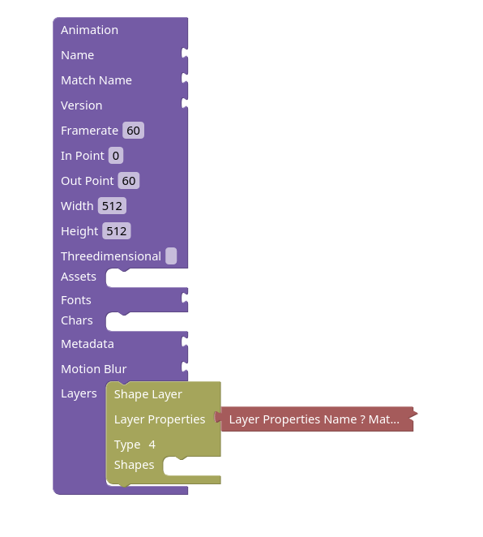
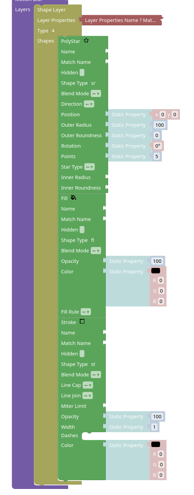
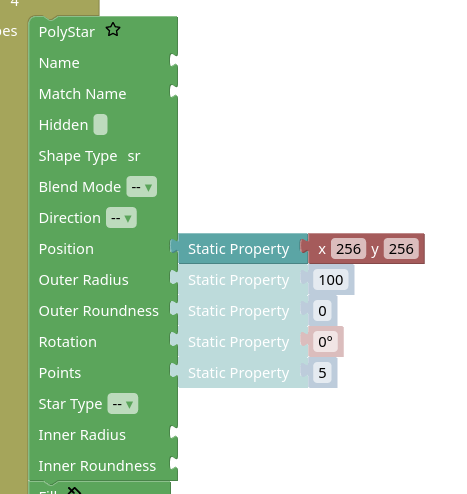
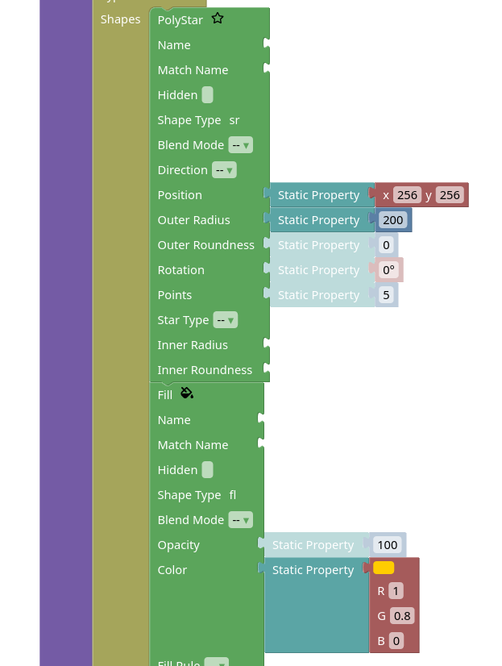
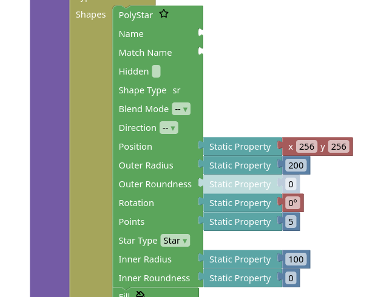
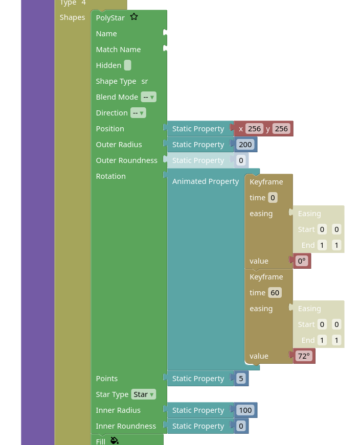
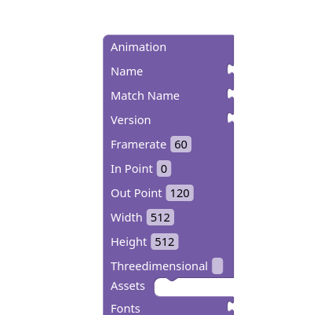

# Lottie from Scratch

In this example, we'll build a simple lottie animation from scratch.

## Introducing the builder tool

The [builder tool](../playground/builder.md) allows you to build lottie animations
from its JSON components using a more convenient interface than manually
editing the cryptic lottie JSON attributes.

You can click on the categories on the toolbar to the left of the builder interface
then drag and drop blocks into the workspace and see the effects.

To the right you have a preview of the animation and the corresponding JSON.

The rest of this guide will assume you are following along using the builder.

Most block can be right-clicked to bring up a context menu and you can select
"Help" from that menu to go on the page that describes the object represented by that block.

## Setting up

Ensure your workspace is empty, if it isn't click on the "Clear" button near the top-right.

Start by selecting the Animation block in the Animation category and dragging it to the workspace.

Then select a Shape Layer (from Layers) and drop it into the Layers slot of the Animation block.

Your workspace should look something like this:

You might have noticed the block attached to the layer.
For simplicity all the common layer properties are in a separate block in the builder,
this allows you to duplicate those blocks to copy the settings across layers and
the block is collapsed by default to avoid cluttering the workspace.

[View workspace at the end of this step](/lottie-docs/breakdown/builder/?url=/lottie-docs/breakdown/images/builder/setting_up.xml)

## Adding Shapes

In order to show something, we need to add some shapes to the layer.

So let's add a Polystar, a Fill and a Stroke from the Shapes category.

Note that the order is important:

This should result in a black pentagon showing in the corner.

[View workspace at the end of this step](/lottie-docs/breakdown/builder/?url=/lottie-docs/breakdown/images/builder/adding_shapes.xml)

## Basic Properties

We start by moving our shape in a more sensible position.

To do so, select Static Property and connect it to the "Position" of the Polystar, then connect a "x y" block to it.
Both these blocks are under "Properties".

You can now edit the values of `x` and `y` to move the pentagon.

For example, setting them both to `256` should move the shape to the center of the screen:

You can do something similar to modify the size of the pentagon and the fill color,
of course you need to select the right block types from the properties toolbox.

The color can be changed by manually updating the RGB components or by selecting
a color from the palette shown after clicking the color preview on the block.

[View workspace at the end of this step](/lottie-docs/breakdown/builder/?url=/lottie-docs/breakdown/images/builder/basic_properties.xml)

## Making a Star

We can turn the pentagon into a star by changing the star type and filling in
some more properties:

Note that while you can use just a number block for "Rotation",
using the angle block allows you to edit the angle in a more intuitive way.
You can tell these block apart because they are a different color and the
angle block shows the &deg; symbol.

[View workspace at the end of this step](/lottie-docs/breakdown/builder/?url=/lottie-docs/breakdown/images/builder/star.xml)

## Animating the Star

Until now we've only seen static properties, but now we can have a look at some
animated ones.

To animate the star rotation, we need to first disconnect the static property from it
and connect an animated property in its place.

Thne attach two keyframe blocks to the animated property.

Once the keyframes are added, attach angle blocks to their value slots and change the second keyframe to have a time of 60 and a value of 72&deg;.

You should now see the star spinning in the preview.

[View workspace at the end of this step](/lottie-docs/breakdown/builder/?url=/lottie-docs/breakdown/images/builder/animation.xml)

## Making the Animation longer

Currently the animation lasts for 1 second (60 frames).

If you want it to last for longer, you need to first change the Out Point in the animation block.
Let's change it to 120 to make the animation last for 2 seconds.

You'll see the star starts blinking, disappearing after a second and reappearing
after another second.

This is because we also need to update the layer Out Point.

By default the layer properties are collapsed, so right click on the Layer Properties
and select "Expand Block" from the context menu, then change its "Out Point"
to match with the Animation block.

Now the star remains visible the whole time, but it stops rotating at the second mark.
To fix that you can update the second keyframe in the star rotation to have a time of 120.
Alternatively you can add a third keyframe with that time and an appropriate value.

[View the final workspace](/lottie-docs/breakdown/builder/?url=/lottie-docs/breakdown/images/builder/final.xml)
